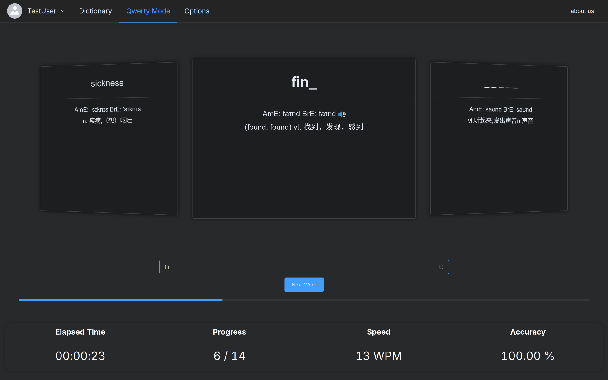

<!--
SPDX-FileCopyrightText: 2024 WordHub Organization <integral@member.fsf.org>

SPDX-License-Identifier: AGPL-3.0-or-later
-->

# WordHub
- WordHub is an elegant word learning solution.

## Features
- Elegant & Simple UI
    - Dark Mode Support
    - Smooth Transition
    - Straightforward Statistics

- Learn, Review & Qwerty Mode
    - Adoption of [SuperMemo Algorithm (SM-2)](https://en.wikipedia.org/wiki/SuperMemo#Description_of_SM-2_algorithm)
    - Qwerty Mode: Tribute to [Qwerty Learner](https://qwerty.kaiyi.cool)

- Multilingual Support for UI & Words
    - Words: English & Japanese
    - UI: Simplified Chinese, English & Japanese
    - Kana Input Support (for Japanese Words)

- Adoption of Restful API in Backend Design

## Screenshots

## License
Licensed under the [GNU Affero General Public License, version 3 or any later version](LICENSE).
